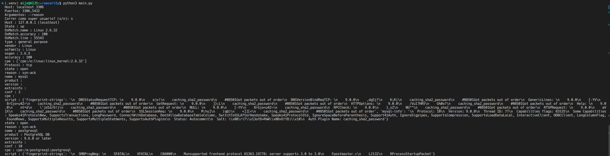

## Requerimientos

- Python 3
- Pip

## Instalación

- Clonar el repositorio
- Instalar las dependencias con `pip install -r requirements.txt`

## Ejecución

- Ejecutar el script con `python3 main.py`
- Seguir las instrucciones en pantalla

## Restricciones

- Argumentos y puertos separados por coma sin espacios

## Ejemplo de funcionamiento

Corriendo en localhost con puertos de mysql 3306 y postgres 5432, obtenemos lo siguiente:

